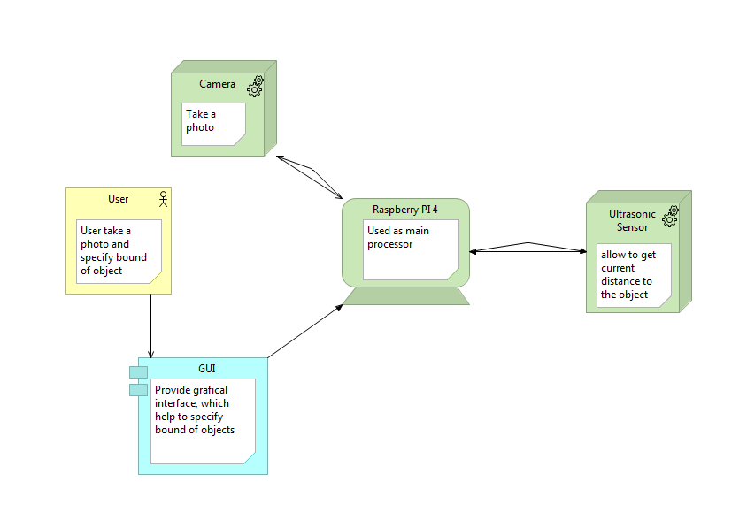
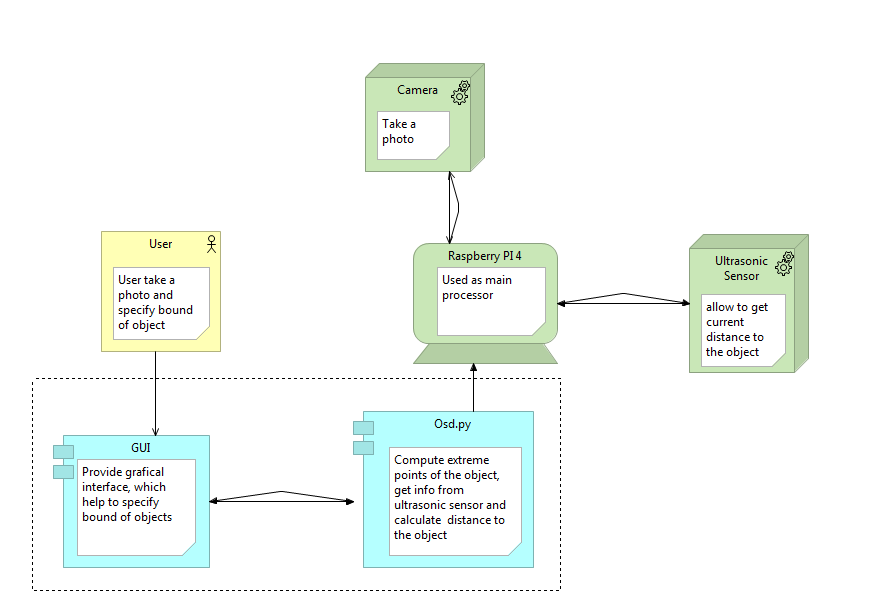

# object-size-determiner

# Этапы
## Определение проблемы
Приложение было задумано как простой в использовании инструмент для определения размеров объектов, использующий специальный прибор Object Size Determinator.

## Выработка требований

### Пользовательские истории:

Как пользователь, я хочу иметь возможность сделать фото объекта, для того чтобы измерить его размер.
Как пользователь, я хочу иметь возможность измерить расстояние от камеры до объекта, чтобы правильно измерить его размер.
Как пользователь, я хочу иметь возможность фильтровать шумы ультразвукового датчика, чтобы результат измерений был точнее.
Как пользователь, я хочу иметь возможность задать контуры измеряемого объекта, чтобы результат измерений был точнее.
Как пользователь, я хочу иметь возможность редактировать контуры измеряемого объекта, чтобы результат измерений был точнее.
## Разработка архитектуры и детальное проектирование
### Level 1: System Context Diagram


### Level 2: Container diagram



## Кодирование и отладка
При написании кода мы столкнулись со следующими проблемами, наш датчик очень плохо работал, были сильные шумы. Чтобы отфильтровать сигнал мы решили попробовать отфильтровать сигнал при помощи фильтра Калмана. В итоге у нас все получилось.
Еще мы отошли от изначальной идеи проекта, так как карты глубины было трудно реализовать программно без использования нейронных сетей. Поэтому в итоге, мы решили использовать готовые алгоритмы библиотеки OpenCV.

[Код](github.com/somn117/object-size-determiner/osd.py/)

[Unit-тесты](github.com/somn117/tests_osd.py/)

[Интеграционные тесты](github.com/somn117/integr_tests_osd.py/ )

# Сборка 
Сборка запускается командой:
```sh
pip install pyinstaller 
pyinstaller --onefile osd.py
```
Тесты:
```sh
python test.py
```
Интеграционные тесты:
```sh
python integrate_test.py
```
Приложение:
```sh
python osd.py
```

# Вывод
В ходе выполнения курсового проекта мы познакомились с принципами конструирования ПО, нами были написаны требования в формате пользовательских историй, разработана архитектура проекта и произведено его детальное проектирование, написана программа а также необходимые тесты, обеспечивающие ее корректную работу. 

В результате мы получили опыт разработки нового проекта с нуля, ознакомились с языком программирования Python и его инструментами, научились работать с микропроцессором и подключаемой к нему периферией, и разработано приложение, позволяющее определять размеры объектов.


